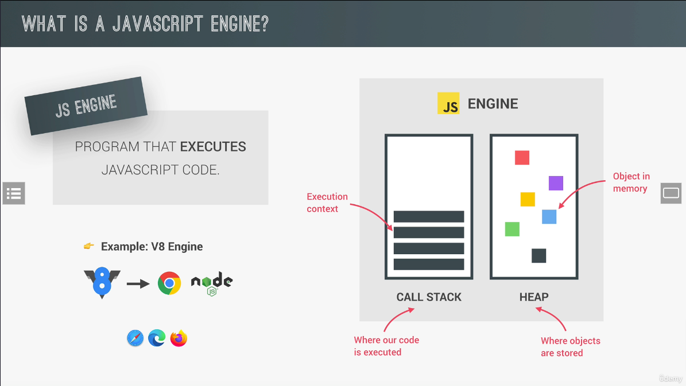
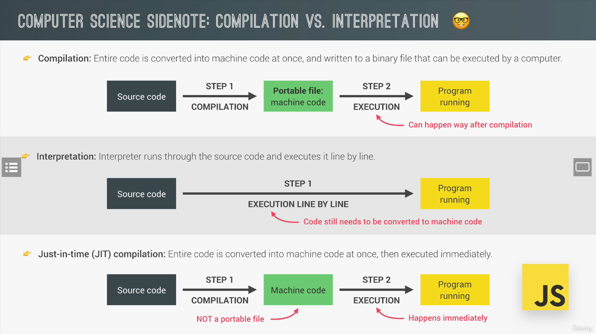
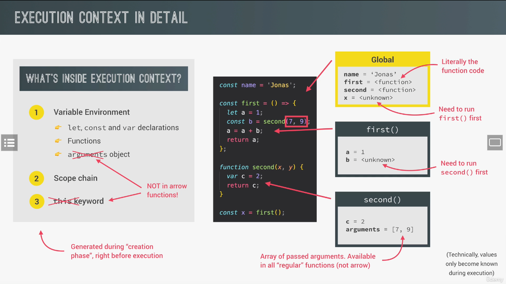
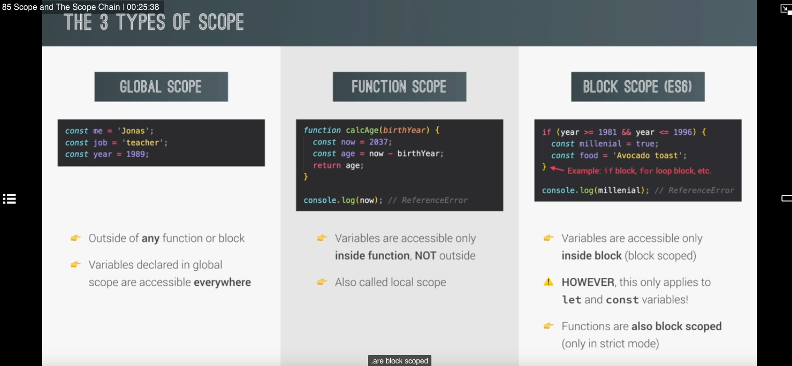

# Paradigm
Definition: Paradigm - An approach and mindset of structuring code, which will direct your coding style and technique.
* Procedural programming
* Object-oriented programming (OOP)
* Function programing (FP)

# Javascript Engines

Javascript Engine contains 2 things: 
* Call stack
  * Where code is executed using Execution context
* Heap
  * Where objects are stored

# Computer science side note: Compilation vs Interpretation
Definitions:
* Compilation: Entire code is converted into machine code at once, and written to a binary file that can be executed by a computer.
* Interpretation: Interpreter runs through the source code and executes it line by line.
* Just-in-time (JIT) compilation: Entire code is converted into machine code at once, then executed immediately.

Javascript is primarily an interpreted language, but modern Javascript engine use a mix of interpretation and Just-In-Time (JIT) compilation to improve performance.

# Execution context
There are 2 types of Execution Contexts:
* Global Execution Context
* Function Execution Context

Execution Context contains:
1. Variable Environment
   * let, const and var declarations
   * Functions
   * arguments object (Not in arrow functions)
2. Scope chain
3. This keyword (Not in arrow functions - lexical)

When the Javascript Program start to run, it creates a global execution context. This execution context has 2 phases: **Creation Phase** and **Execution Phase**

In the creation phase, 4 different things happen:

1. In Global execution context, Javascript will create global object
2. We will always create a **this** object
3. We set assign memory space for any variables or any functions.
4. Variables declarations get assigned a default value of undefined (hoisting) and function themselves place entirely in memory

The next type of execution context is the Function Execution context which will happen when a function is invoked. The function execution context is exactly the same as global execution context except for creating a global object we create an arguments object and any arguments passed in the function get added as it like local variables to the execution context.


# Closure

Whenever you have a function inside another function, even if parent function exection context is removed from the stack the inner function will retain access to the variable environment of the parent execution context => Closure.

```javascript
function out(x) {
  function in(y) {
    return x + y;
  }
}
```

# Scope
Definition: Space or environment in which a certain variable is declared.
There is global scope, function scope, and block scope.
Scope chain: Javascript is going to look inside the current execution context to see if the variable "x" exist, if doesn't so it will go up the scope chain to the next closest parent execution context in this case it is closure scope, it will look for that variable and it exist
* Global scope
  * Contain variables declared outside any function or block
  * Variables declared in global scope can be accessed everywhere


# Asynchronous
In Javascript:
* Tasks will be handled by Callstack.
* Async jobs bill be run behind the scene in WebAPIs which is part of runtime environment (Browser engine, Node engine, etc.) - Example of async jobs: Timer (setTimeout, setInterval), DOM event listeners (addEventListeners), Fetch API (fetch).
* Async tasks and their callbacks will be registered in the WebAPIs first, only the async tasks are done (load image, set timeout, fetch, etc.), the callback will be put in either `Callback Queue` or `Microtasks Queue`.
* `Event loop` looks at the `Callstack`, if it's empty (except for Global Execution Context), event loop will push tasks from `Callback Queue` and `Microtasks Queue` to the `Callstack`. 
* `Callback Queue` holds regular callbacks from Timer and DOM tasks.
* `Microtasks Queue` holds callbacks from Promises (then, catch).
* Priority: `Microtasks Queue` > `Callback Queue` -> That means, if there are tasks in both Microtasks Queue and Callback Queue, `Event Loop` will prioritize the tasks in Microtasks Queue and put them in the Callstack. When Microtasks Queue is empty, Event Loop will look into the Callback Queue and put them to the Callstack.
  


# Call, Apply and Bind

`Call` and `apply` behave exactly the same way, they will immediately invoke the function. With **call** you pass argument one by one, with **apply** you pass as an array.
Bind exactly the same as call, but instead of immediately invoke the function, it will return you a brand new function so you can invoke later

```javascript
const me = {
  name: "luu",
  age: 24,
};

function greeting(language1, language2) {
  console.log(
    `Hi, my name is ${this.name} and I'm ${this.age} years old. And I love ${language1} and ${language2}`
  );
}

greeting.call(me, "javascript", "english");
greeting.apply(me, ["javascript", "english"]);
const laterUse = greeting.bind(me, "javascript", "english");
laterUse();
```

# This keyword

- Call **this** in method: this => object call that method (not the object contains method)
- Call **this** in simple function: this => undefined (strict mode) or global object (sloppy mode)
- Call **this** in arrow function: this => this of parent scope (method or global). This is call lexical this
- Call **this** in event listener: this => DOM Element that call callback.

# Primitives vs Objects (Primitives vs Reference Types)

JS Engine has two components:

- Call stack where functions are executed: Primitives (or Primitive types) are store in the call stack, in execution context which they are declared
- Heap where objects are stored in memory: All objects (or Reference types) are get stored in the memory heap

## Primitives

When we declare a variable like _age_ equals 30, in Call stack Javascript will create a so-called unique **identifier** with the variable name (_age_). Then a piece a
memory will be allocated with a certain address, 001 in this example and finally the value will be stored in memory at the specified address. So in this case, the value 30 will be specified at memory address 001
**IMPORTANT**: The identifier actually points to the address and not to the value itself. So we say the age variable is equal to 30, but in fact the age variable is equal to the memory address _0001_ which holds the value of 30.
When we declare new varialbe _oldAge_ equals to _age_, it will simply point to the same memory address as the age variable, so it also holds the value of 30.
In the next line, we set _age_ to 31, the value at address _0001_ will certainly not become 31 because that would change _oldAge_ as well, since they both point to the same address. The value at a certain memory address is **immutable**. In stead, a new piece of memory is allocated and the age identifier now simply points to the new address which is holding the new value of 31.

## Reference Types

When a new object is created such as _me_ object, it is stored in the heap. And such as before, there is a memory address and then the value itself. In case of reference values like _me_ object, the _me_ identifier does not point directly to the newly created memory address in the heap. In stead, it will point to a new piece of memory that's created in the stack. And this new piece of memory will point to the object that's in the heap by using memory address as its value. In other words, the piece of memory in the call stack has a reference to the piece of memory in the heap. So why we call object reference type
And it works this way because objects maybe too large to be stored in the call stack.
When we created a new variable _friend_ equals to _me_ object, the _friend_ identifier will point to the exact same memory address as _me_ identifier. That address contains the reference, which then points to the object itself. When we change a property in the _friend_ object, we modify the property right in the heap. By the way, even though we defined the _friend_ variable as a constant, we can actually still manipulate the object without problems! Because we actually not changing the value in memory for the _friend_ identifier, all we did is to change the value in the heap. So not variables declared with const is immutable. In fact, it's only true for primitive values, but not for reference values!


# Prototypes

Each and every function in Javascript automatically has a property called **prototype** includes **construction function**. Now every object created by constructor function will get access to (inherit) all the methods and properties that we defined on the constructors prototype property.

A prototype of an object is simply the prototype property of constructor function

```javascript
Object.getPrototypeOf(object);
ConstructorFunction.prototype;
object.__proto__;
ConstructorFunction.prototype.isPrototypeOf(object);
```


The prototype of an object is also an object. So it also has prototype, we call this prototype chain. The ancestor of all objects is Object.prototype, the prototype of Oject.prototype is **null**

There are three ways to create an object derived from a prototype, here we wil also implement how to inherit between **classes** (Javascript actually doesn't have classes)

1. Using Object.create

- Step 1: Create object called **personProto** (we use this object as prototype of **studentProto** object)
- Step 2: Create object called **studentProto** inherit from **personProto** (we use this objet as prototype of **studentInstance** object)
- Step 3: Create object called **studentInstance** inherit from **studentProto**

```javascript
// Step 1
const personProto = Object.create(Object.prototype);
personProto.init = function (firstName) {
  this.firstName = firstName;
};

// Step 2
const studentProto = Object.create(personProto);
studentProto.init = function (firstName, grade) {
  // Here we borrow method from personProto so we need to explicitly tell *this* in personProto.init method is studentProto object.
  personProto.init.call(this, firstName);
  this.grade = grade;
};

// Step 3
const studentInstance = Object.create(studentProto);
studentInstance.init("Luu", 5);
```

2. Using Constructor Function

Internal Step when we create a Construction Function

- Step 1: Javascript implicitly create an empty object
- Step 2: Javascript bind **this** in the Constructor Function to the newly created object (which originally have value of global object in sloppy mode or undefined in strict mode)
- Step 3: Javascript set that constructor function prototype propety to be the prototype of newly created object. The properties after **this.** will includes in the object, the properties and methods which we want all the object to inherit should put in the prototype of object (object.**proto** or constructorFunction.prototype)
- Step 4: Javascript implicitly return that object

**Note**: Constructor Function works fine with function declaration and function expression. Arrow function does not have this so it won't work

```javascript
function Person(firstName) {
  this.firstName = firstName;
}

Person.prototype.legs = 2;

function Student(firstName, grade) {
  Person.call(this, firstName);
  this.grade = grade;
}

Student.prototype = Object.create(Person.prototype);

Student.prototype.speak = function () {
  console.log(this.firstName, this.grade);
};

const student = new Student("Luu", 5);
```

3. Using ES6 Class Notation

```javascript
class Person {
  constructor(firstName) {
    this.firstName = firstName;
  }
}

// ES6 Classes haven't have mechanism for setting properties in class so we need to do this
Person.prototype.legs = 2;

class Student extends Person {
  constructor(firstName, grade) {
    super(firstName);
    this.grade = grade;
  }

  speak() {
    console.log(this.firstName, this.grade);
  }
}

const student = new Student("Luu", 5);
```